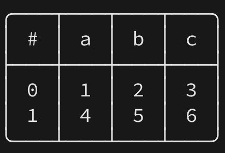
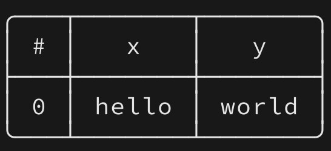
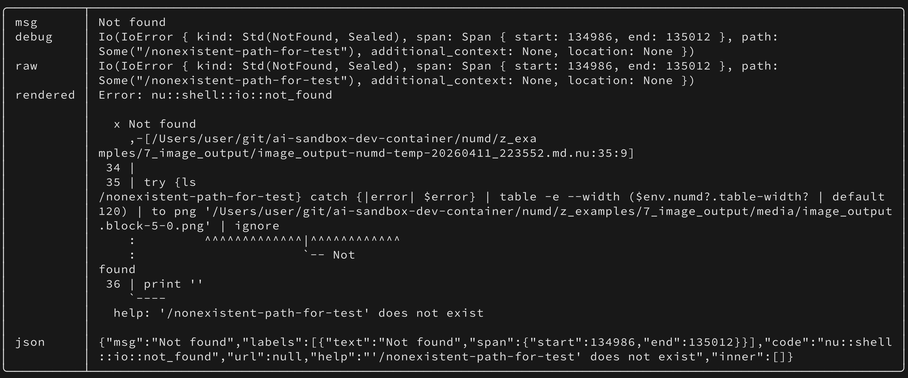

# Image output fence option

The `image` (short: `i`) fence option rasterizes a code block's output to a PNG
file via the `to png` plugin, rather than writing `# =>` inline lines.
The generated `` reference lands after the closing fence.

## Single-group block

```nu image
[[a b c]; [1 2 3] [4 5 6]]
```



## Multi-group block

Each command group (separated by a blank line) gets its own image file.

```nu image
'first group output'

[[x y]; ['hello' 'world']]
```




## Image combined with try

When combined with `try`, the error value is rendered and rasterized just like
any other output — so you can capture error formatting in an image.

```nu image, try
ls /nonexistent-path-for-test
```



## Image combined with no-run

`no-run` wins: the block is not executed and no PNG is produced.
Any existing image files on disk are left untouched.

```nu image, no-run
'this should not run'
```

## Image combined with no-output

`no-output` wins: the pipeline runs for its side effects but no PNG is written
and no image reference is emitted.

```nu image, no-output
'executes but no image'
```
